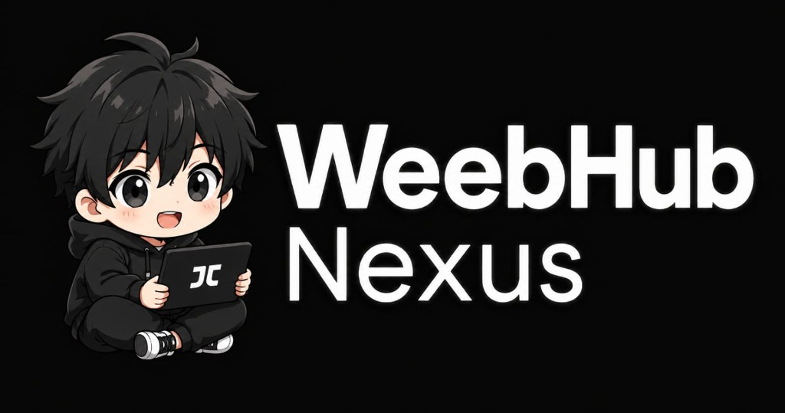

<div align="center">
  <a href="" target="_blank">
    
  </a>

  <h2 align="center">WeebHub Nexus</h3>

  <p align="center">
    An open-source Anime streaming site built with Nextjs 14
  </p>
</div>

# About the Project

Experience uninterrupted, ad-free streaming with seamless progress tracking thanks to AniList integration, powered by the Consumet API. Our platform, built using Next.js 14, MongoDB, and Redis, ensures a smooth and enjoyable user experience.

## ✨ Features

- [x] **Search**: Get a list of all animes and mangas you want using filters.
- [x] **Watch**: Stream any available episode, whether dubbed or subbed.
- [x] **Comment**: Share your thoughts on episodes or provide helpful information for others.
- [x] **Log In**: Sign in with your AniList account.
- [x] **AniList Integration**: Seamlessly sync your AniList account to carry over settings and animes.
- [x] **Keep Watching**: Resume episodes from where you left off with local tracking.
- [x] **Track Your Favorites**: Organize your animes and mangas into Completed, Dropped, Planning, and more.
- [x] **Modern Video Player**: Enjoy a sleek and up-to-date video player experience.
- [x] **Fully Responsive**: Access and enjoy your content on all devices.

## Environment Variables

To run this project, you will need to add the following environment variables to your `.env.local` file:

```env
# Base URL for your application
NEXT_PUBLIC_URL=http://localhost:3000

# Consumet API URL
NEXT_PUBLIC_CONSUMET_URL=

# AniList API Configuration
GRAPHQL_ENDPOINT=https://graphql.anilist.co
ANILIST_CLIENT_ID=
ANILIST_CLIENT_SECRET=

# NextAuth Configuration
NEXTAUTH_SECRET=
NEXTAUTH_URL=http://localhost:3000

# MongoDB Connection URI
MONGODB_URI=

# Node Environment
NODE_ENV=production
```

## 🛠️ Technologies Used

Front-end:
- Next.js 14
- Tailwind CSS
- Context API
- Framer Motion
- Consumet API
- Artplayer

Back-End:
- Next.js App Router (Server Actions)
- MongoDB / Mongoose
- NextAuth

## Run Locally

Clone the project

```bash
git clone https://github.com/BiniFn/WeebHub-Nexus.git
```

Go to the project directory

```bash
cd WeebHub-Nexus
```

Install dependencies

```bash
npm install
```

Start the server

```bash
npm run dev
```

## Vercel Deployment

WeebHub Nexus is fully optimized for Vercel deployment. 
1. Create a MongoDB cluster on MongoDB Atlas and get your connection string.
2. Push your code to GitHub.
3. Import the project into Vercel.
4. Set the environment variables in the Vercel dashboard.
5. Deploy!
